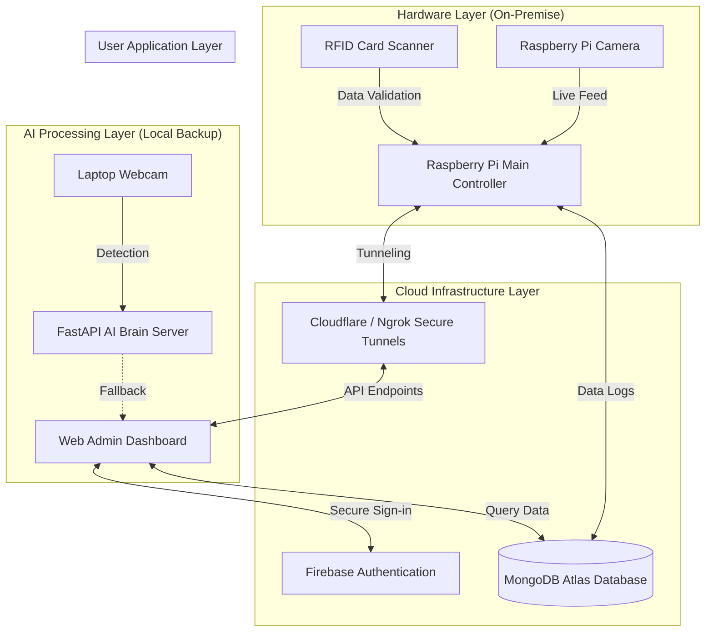

# IntelliAccess System Upgrade & Architecture Proposal

## 1. System Architecture Overview

The IntelliAccess System runs on a Hybrid-Cloud integration architecture. It merges on-premise hardware — the Raspberry Pi and Local AI Servers — with a remote Cloud Infrastructure, enabling the administration to access the system from anywhere.

---

## 2. List of Major System Upgrades & Fixes

The following are the critical technical upgrades implemented to bring the entire system to a production-ready and stable state:

### A. Remote Cloud Tunneling & Web Integration
Bridged the local hardware network to the internet. The system can now receive commands — such as remote video streaming and AI scanning — even when the administration is not connected to the same local WiFi, made possible by secure Ngrok/Cloudflare tunnel configurations.

### B. RFID Hardware Data Validation & System Stability
Fixed the hardware-to-backend communication layer. There was a bug where the RFID data transmission would spam and corrupt entries during reads. Strict data buffering and validation mechanisms were implemented so that only legitimate access data enters the database.

### C. "AI Brain" Local Laptop System Fallback
To ensure continuous operation even when the external Raspberry Pi hardware encounters an error, the `start_brain_system.bat` fallback was fixed and integrated. This allows the system to use a standard laptop webcam for AI-powered scanning, connected directly to the Web UI.

### D. Data Export & Analytics (Report Generation)
Built a report download functionality directly inside the Admin Dashboard, allowing administrators to easily trigger and download security reports and access history logs.

### E. System Security & Access Controls
Identified and removed a security vulnerability at the main registration point of the application, where users could self-assign "Admin" privileges without authorization. This is now locked down.

### F. Official UI Branding & Deployment Configuration
Removed all generic placeholder assets and integrated the official IntelliAccess branding throughout the dashboard. Added an easy deployment script (`CLIENT_SETUP.md` and `.bat` file) so the client can set up and launch the system at their command center with minimal effort.

---

## 3. Scope of Additional Upgrade Modules

The following features were outside the initial system requirements but were critical to implement in order to ensure stability and production-readiness. Below is a detailed breakdown of each module:

---

### 🔌 1. Hardware-to-Cloud API Tunneling (Ngrok / Cloudflare)

- Configured a secure, persistent tunnel from the Raspberry Pi to the public internet using **Cloudflare Tunnel** as the primary method and **Ngrok** as the fallback.
- Connected the local hardware network to the Vercel-deployed frontend **without requiring a static IP** or router port forwarding — making it fully remote accessible.
- Set up **environment variable management** on Vercel so the Pi's API endpoint URL is dynamically injected, especially when the tunnel address changes on restart.
- The Admin Dashboard now has a dedicated **NgrokImage component** that auto-fetches the live camera feed from the Pi, complete with loading states, error boundaries, and reconnect logic built into the UI.
- **UI Transition:** When the dashboard loads, the live feed appears seamlessly — a skeleton loader is shown first, followed by a smooth fade-in of the stream. When the Pi is offline, the UI degrades gracefully with a proper fallback state instead of crashing.

---

### 📡 2. RFID Buffer Stabilization & Hardware Fix

- Fixed a critical bug where the RFID reader was spamming duplicate and garbage data — causing false access log entries and database pollution.
- Implemented **strict input buffering** on the backend: every raw RFID read is validated and cross-checked against a minimum character length threshold before being accepted.
- Added a **debounce / cooldown mechanism** to prevent the same card from being read multiple times within a short window — replicating the physical behavior of real-world card scanners.
- **Scanning Behavior:** The system now follows a clear, sequential feedback cycle — scan → validation → database write → UI update. The access log no longer runs without a valid card being physically presented.

---

### 🧠 3. AI Brain Server Fallback Integration (Laptop Webcam)

- Built a **local AI fallback pipeline** powered by `start_brain_system.bat` — this launches a FastAPI server connected to the laptop's webcam as a secondary scanning hardware source.
- Integrated the **`/detect` endpoint** into the Admin Dashboard: administrators can now trigger a manual scan via webcam even without the Raspberry Pi camera.
- **Scanning Flow in the UI:**
  - Admin selects "Scan via Webcam" from the dashboard.
  - A live webcam preview appears inside a modal/overlay with a **smooth slide-in animation**.
  - A frame is auto-captured when the scan button is pressed and sent to the AI backend for processing.
  - The detected plate or result is displayed **in-place within the same modal** — no page redirect, no separate screen.
  - Upon a successful detection, the result card triggers a **brief highlight animation (glow/flash)** to give the admin clear visual feedback.
- **AI Brain Server** (FastAPI + OpenCV): processes the image frame and returns the detected text, confidence score, and timestamp.

---

### 📊 4. Data Export & Report Generation

- Implemented a **"Download Report"** feature directly inside the Admin Dashboard — a single button action that retrieves the full access history as a structured, exportable file.
- The export generates a report containing timestamp ranges, user data, and access event logs — ready for documentation and auditing purposes.
- **UI Transition:** When the Download button is pressed, a brief inline loading indicator (spinner within the button itself) appears, followed by an automatic file download. No page reload, no separate screen — the action is entirely in-context.

---

### 🔒 5. Security Hardening, Scripts & Official Branding

- **Security Fix:** Removed the "Admin" role option from the registration form — users can no longer self-assign administrative privileges during sign-up.
- **Deployment Scripts:** Created `CLIENT_SETUP.md` and a `.bat` launcher file so the client can start the entire system without any technical knowledge. One-click setup.
- **Official Branding:** Replaced all generic placeholder icons and logos with the official **IntelliAccess branding** (custom logo, favicon) across all pages of the dashboard.
- **UI Consistency:** The visual identity is now consistent from the browser tab all the way through the dashboard — logo, color palette, and typography are all aligned to the system brand.

---

## 4. Implemented Features Aligned to Study Requirements

The following is a direct mapping of what was built in IntelliAccess against the core requirements of an AI-Based Vehicle Security System:

### 🪪 1. RFID Authentication
- Raspberry Pi-connected RFID card scanner handles vehicle/personnel identity verification at the access point.
- Strict **input buffering and debounce validation** on the backend ensures only clean, intentional reads are logged — eliminating duplicate and ghost scan entries.
- Each successful RFID event is timestamped and written to the database in real time.

### 📷 2. Camera Monitoring
- **Raspberry Pi Camera** serves as the primary long-range visual monitoring source, streaming a live feed directly to the Admin Dashboard.
- A **Laptop Webcam** is integrated as a secondary hardware fallback — ensuring camera-based monitoring stays active even if the Pi camera encounters a hardware fault.
- The live feed is embedded in the dashboard with a smooth skeleton-to-stream UI transition and graceful offline fallback state.

### 🧠 3. AI-Based Vehicle Detection
- A **FastAPI + OpenCV AI Brain Server** processes captured camera frames and performs license plate detection using computer vision.
- The system returns the **detected plate text, confidence score, and timestamp** per scan.
- Detection can be triggered automatically from the Raspberry Pi camera feed or manually via the webcam scan modal in the dashboard — with in-place result display and visual feedback animation.

### 📲 4. Mobile / Text Notification
- An SMS/text notification system is integrated and fires on key access events — alerting relevant personnel when a vehicle is detected, verified, or flagged.
- Notifications are sent automatically without requiring an admin to be actively viewing the dashboard.

### 🔔 5. Alarm System
- A **hardware buzzer** wired to the Raspberry Pi's GPIO triggers an audible alarm upon unauthorized or unrecognized access attempts.
- This provides an immediate, physical-layer alert at the point of entry — independent of software or network state.

### 🖥️ 6. Unified Security Platform
- All modules — RFID, camera, AI detection, notifications, alarm status, and access logs — are integrated into a **single Admin Dashboard** deployed on Vercel.
- The platform is accessible from any browser, at any location, through a secure cloud tunnel (Cloudflare / Ngrok).
- In-dashboard **system notifications** keep administrators informed of real-time access events without leaving the interface.
